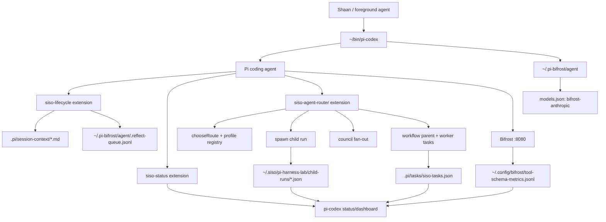

# Pi Codex Harness Handoff

Date: 2026-05-06

Audience: agents building or integrating the next `pi-codex` / Pi+Bifrost harness slice.

## Bottom Line

- `pi-codex` is the foreground launcher and daily-driver shell.
- `siso-agent-router` is the orchestration brain loaded inside `pi-codex`.
- `siso-status` is the HUD/dashboard/metrics layer.
- `siso-lifecycle` is the restore/checkpoint/lesson layer.
- Bifrost remains the model router and measurement source.
- `open-claude-code` is a comparison oracle and subsystem checklist, not the runtime.

The product is not one file. It is this stack:

```text
~/bin/pi-codex
  -> pi binary
  -> isolated profile: ~/.pi-bifrost/agent
  -> provider: bifrost-anthropic
  -> extensions:
       packages/siso-lifecycle/dist/index.js
       packages/siso-status/dist/index.js
       packages/siso-agent-router/dist/index.js
  -> Bifrost on 127.0.0.1:8080
  -> child Pi/Codex workers
  -> child/task/lifecycle/status records
```

## Mental Model



## Layer Responsibilities

| Layer | Owns | Do not make it own |
| --- | --- | --- |
| `pi-codex` wrapper | Launch defaults, isolated profile, Bifrost preflight, extension loading, helper commands | Routing policy, worker scheduling, task state |
| `.pi-bifrost/agent` profile | Compact Pi kernel, Bifrost model aliases, optional small skill router | Global SISO context, real `~/.pi/agent` state |
| `siso-agent-router` | `siso` tool, route policy, profiles, spawn/council/workflow, tasks, repo/skill lookup, child records | Foreground launcher defaults |
| `siso-status` | live HUD, Bifrost metrics, dashboard status text/JSON | Mutating workflows or child state |
| `siso-lifecycle` | correction capture, restore checkpoints, lessons/reflection queue | Agent routing or model selection |
| Bifrost | model routing, token/latency logs, backend aliasing | Harness state or task orchestration |

## What `pi-codex` Does

Launcher:

```text
/Users/shaansisodia/bin/pi-codex
```

Key behavior:

- special-cases `status`, `dashboard`, `doctor`, and `verify`;
- fails early if `pi` is missing;
- fails early if Bifrost is not listening on `127.0.0.1:8080`;
- sets `PI_CODING_AGENT_DIR=/Users/shaansisodia/.pi-bifrost/agent` unless overridden;
- sets `PI_OFFLINE=1` and `PI_TELEMETRY=0`;
- defaults to lean extension tool modes;
- injects provider/model/tools only when the caller did not already set them;
- disables broad eager loading with `--no-skills`, `--no-context-files`, and `--no-extensions`;
- reloads only the lab extensions that exist in `dist/`.

Default effective command shape:

```bash
pi \
  --provider bifrost-anthropic \
  --model claude-sonnet-4-6 \
  --tools read,bash,edit,write,ls \
  --no-skills \
  --no-context-files \
  --no-extensions \
  -e /Users/shaansisodia/SISO_Workspace/pi-harness-lab/packages/siso-lifecycle/dist/index.js \
  -e /Users/shaansisodia/SISO_Workspace/pi-harness-lab/packages/siso-status/dist/index.js \
  -e /Users/shaansisodia/SISO_Workspace/pi-harness-lab/packages/siso-agent-router/dist/index.js
```

Useful wrapper commands:

```bash
~/bin/pi-codex
~/bin/pi-codex status
~/bin/pi-codex dashboard
~/bin/pi-codex dashboard --json
~/bin/pi-codex doctor
~/bin/pi-codex verify
```

Do not mutate the real profile at:

```text
/Users/shaansisodia/.pi/agent
```

Use the isolated profile:

```text
/Users/shaansisodia/.pi-bifrost/agent
```

## What `siso-agent-router` Does

Package:

```text
/Users/shaansisodia/SISO_Workspace/pi-harness-lab/packages/siso-agent-router
```

Primary tool inside Pi:

```text
siso
```

Supported composite actions:

```text
route
spawn
council
workflow
workflow/orchestrate
child
task
skill
repo
```

Example prompts inside `pi-codex`:

```text
Use siso with action="route" task="inspect this repo and summarize the package scripts".
Use siso with action="spawn" task="Inspect package scripts and return concise JSON." timeoutMs=60000.
Use siso with action="spawn" background=true task="Inspect package scripts in the background." timeoutMs=60000.
Use siso with action="child" op="list" limit=5.
Use siso with action="council" mode="compare" task="Compare two implementation paths." limit=2 timeoutMs=70000.
Use siso with action="workflow/orchestrate" task="Plan and execute a small worker fan-out." workerCount=2 timeoutMs=120000.
Use siso with action="skill" op="search" query="routing" limit=2.
Use siso with action="repo" op="recommend" catalog="both" limit=8.
```

### Route Policy

The router classifies task text into profile routes:

| Task shape | Typical profile | Model alias | Permission profile |
| --- | --- | --- | --- |
| read/search/research | `minimax.scout` | `claude-haiku-4-5-20251001` | `plan` |
| small edits | `minimax.worker` | `claude-haiku-4-5-20251001` | `accept_edits` |
| verification | `minimax.verifier` | `claude-haiku-4-5-20251001` | `plan` |
| strict JSON/schema/tool-call work | `gpt54mini.*` | `gpt-5.4-mini` | role-dependent |
| larger sprint-style edits | `spark.worker` | `claude-sonnet-4-6` | `accept_edits` |
| review without writes | `spark.reviewer` | `claude-sonnet-4-6` | `plan` |
| planning/architecture | `gpt55.planner` | `claude-opus-4-7` | `plan` |
| oracle/advisory | `gpt55.oracle` | `claude-opus-4-7` | `plan` |
| complex rescue/review | `codex.rescue` / `codex.review` | `codex` | `ask` |

Key files:

```text
packages/siso-agent-router/src/profile-registry.ts
packages/siso-agent-router/src/route-policy.ts
packages/siso-agent-router/src/spawn-layer.ts
packages/siso-agent-router/src/council-layer.ts
packages/siso-agent-router/src/workflow-layer.ts
packages/siso-agent-router/src/task-store.ts
packages/siso-agent-router/src/agent-events.ts
```

## What We Recently Built

The latest implementation imported the best useful `open-claude-code` concepts into the Pi-native router without adopting OCC as runtime.

### Permission Profiles

Added:

```text
plan
ask
accept_edits
deny_by_default
lab_bypass
```

These are attached to every profile. Child tool exposure now follows the profile:

- `plan` and `ask` do not expose `edit` / `write` to child Pi workers.
- `accept_edits` and `lab_bypass` can expose edit/write tools.
- `deny_by_default` exposes no tools.

### Agent Events

Added `SisoAgentEvent`:

```text
run_started
model_request
assistant_message
tool_call
tool_result
permission_check
run_finished
```

Event surfaces:

```text
foreground
child
council
workflow
occ-reference
```

Composite `siso` actions now wrap route/spawn/council/workflow with:

```text
foreground permission_check
child/council/workflow event trail
foreground tool_result
```

This makes the agent run inspectable instead of only returning text.

## State And Artifacts

| Artifact | Path | Owner |
| --- | --- | --- |
| launcher | `/Users/shaansisodia/bin/pi-codex` | foreground shell |
| isolated Pi profile | `/Users/shaansisodia/.pi-bifrost/agent` | `pi-codex` |
| model aliases | `/Users/shaansisodia/.pi-bifrost/agent/models.json` | profile/Bifrost |
| compact kernel | `/Users/shaansisodia/.pi-bifrost/agent/SYSTEM.md` | profile |
| optional skill router | `/Users/shaansisodia/.pi-bifrost/agent/skills/siso-capabilities/SKILL.md` | profile |
| child run records | `~/.siso/pi-harness-lab/child-runs/*.json` | `siso-agent-router` |
| child stdout stream | `~/.siso/pi-harness-lab/child-runs/*.stdout.jsonl` | `siso-agent-router` |
| child stderr log | `~/.siso/pi-harness-lab/child-runs/*.stderr.log` | `siso-agent-router` |
| task store | `.pi/tasks/siso-tasks.json` in project cwd | `siso-agent-router` |
| lifecycle checkpoints | `.pi/session-context/*.md` in project cwd | `siso-lifecycle` |
| reflect queue | `/Users/shaansisodia/.pi-bifrost/agent/.reflect-queue.jsonl` | `siso-lifecycle` |
| Bifrost metrics | `~/.config/bifrost/tool-schema-metrics.jsonl` | Bifrost/status |
| Bifrost logs DB | `~/.config/bifrost/logs.db` | Bifrost |
| research inbox | `research/inbox/` | research agents |
| repo catalogs | `research/*candidate-catalog*` and `docs/*candidate-catalog*` | research pipeline |

## Dashboard And Visibility

Wrapper commands:

```bash
~/bin/pi-codex status
~/bin/pi-codex dashboard
~/bin/pi-codex dashboard --json
```

Dashboard combines:

- latest Bifrost model/tool/body/kernel metrics;
- task counts and workflow tasks from `.pi/tasks/siso-tasks.json`;
- child run records from `SISO_CHILD_RUN_DIR` or `~/.siso/pi-harness-lab/child-runs`;
- reverse-engineering run summaries;
- token budget status;
- reflect queue length.

Relevant files:

```text
scripts/pi-codex-status.mjs
scripts/pi-codex-doctor.mjs
packages/siso-status/src/index.ts
packages/siso-status/src/status-state.ts
packages/siso-status/src/bifrost-metrics.ts
```

## Lifecycle And Restore

`siso-lifecycle` watches Pi lifecycle events and maintains continuity without stuffing every future prompt.

It handles:

- correction capture;
- `.reflect-queue.jsonl`;
- session checkpoints under `.pi/session-context`;
- touched file summaries;
- project lessons;
- restore summaries.

Relevant files:

```text
packages/siso-lifecycle/src/index.ts
packages/siso-lifecycle/test/lifecycle.test.ts
```

## Research Context To Carry Forward

Important docs:

```text
docs/reverse-engineering-infrastructure-plan.md
docs/claude-code-feature-parity-checklist.md
docs/repo-candidate-catalog.md
docs/pi-ecosystem-broad-candidate-catalog.md
research/inbox/2026-05-06-open-claude-code.md
decisions/2026-05-06-occ-contracts-not-runtime.md
experiments/pi-codex-mvp.md
experiments/open-claude-code-bifrost.md
```

Important research conclusions:

- `open-claude-code` is useful as a subsystem checklist and bakeoff target, not runtime.
- `1jehuang/jcode` is useful for terminal feel, swarm/file-touch, memory budgets, status UX, and agentgrep/codebrain ideas.
- Pi ecosystem plugins such as `pi-tasks`, `planning-with-files`, `pi-supervisor`, `pi-rewind`, and wiki/context packages are implementation sources for small Pi-native features.
- Sourcegraph/package search has already produced broad catalogs; do not restart discovery from zero.

Use the queue workflow for more research:

```text
docs/pi-research-queue-workflow.md
research/queues/research-batch-*.json
```

## Integration Rules For The Next Agent

1. Keep `pi-codex` as the foreground launcher.
2. Keep Bifrost as the only default model router.
3. Keep `~/.pi/agent` untouched unless explicitly requested.
4. Build features inside lab packages first.
5. Use the isolated `.pi-bifrost/agent` profile for experiments.
6. Prefer one small `siso` action or dashboard surface per feature.
7. Add tests before wiring live behavior when possible.
8. Add smoke coverage if the feature affects the wrapper, live routing, child runs, status, or lifecycle.
9. Write research findings to `research/inbox/`.
10. Write architectural decisions to `decisions/`.

## Good Next Build Slices

### 1. Event Summary In Dashboard

Goal: make `SisoAgentEvent` visible in `pi-codex dashboard`.

Target files:

```text
scripts/pi-codex-status.mjs
packages/siso-status/src/status-state.ts
packages/siso-agent-router/src/spawn-layer.ts
```

Expected result:

- dashboard shows recent event counts by type;
- latest child row can show last `tool_call` / `tool_result`;
- foreground `permission_check` is visible for route/spawn/council/workflow.

Verification:

```bash
npm run smoke:pi-codex-dashboard
npm run smoke:agent-router:lean
```

### 2. Foreground Mutation Gating

Goal: use `PermissionProfile` to gate foreground `siso` actions that mutate state.

Target files:

```text
packages/siso-agent-router/src/index.ts
packages/siso-agent-router/src/worker-guard.ts
packages/siso-agent-router/test/index.test.ts
```

Expected result:

- read-only actions remain `plan`;
- task creation/update, child interrupt/resume, and cleanup require `ask` or explicit lab bypass;
- every decision emits a `permission_check` event.

Verification:

```bash
npm --workspace @siso/pi-siso-agent-router test -- index
```

### 3. Deferred Tool Schema Registry

Goal: child agents receive a tiny capability list first and request rich schemas only when needed.

Target files:

```text
packages/siso-agent-router/src/index.ts
packages/siso-agent-router/src/skill-hub.ts
packages/siso-agent-router/src/context-loader.ts
```

Expected result:

- smaller default prompt;
- `siso` can expose tool summaries without eager full schemas;
- dashboard tracks tool schema chars before/after.

Verification:

```bash
npm run smoke:agent-router:lean
npm run check:token-budgets
```

### 4. Pi vs OCC Extended Bakeoff

Goal: keep OCC as a regression oracle while Pi remains the product.

Target files:

```text
scripts/smoke-pi-vs-occ-bifrost.mjs
experiments/open-claude-code-bifrost.md
research/bakeoff/2026-05-06-open-claude-code/
```

Expected result:

- mirrored text/read/grep/edit-dry-run cases;
- artifact reports include calls, tokens, latency, pass/fail;
- weaker Pi rows become implementation tickets.

Verification:

```bash
npm run smoke:pi-vs-occ-bifrost
```

## Verification Commands

Local deterministic gate:

```bash
npm run verify:local
```

Core development gate:

```bash
npm run build
npm run typecheck
npm test
npm run smoke:agent-router:lean
npm run smoke:pi-codex-wrapper-surface
npm run smoke:pi-codex-dashboard
```

Live Bifrost gate:

```bash
npm run verify:live
```

Full live gate:

```bash
npm run verify:live:full
```

Doctor:

```bash
~/bin/pi-codex doctor
```

## Hand-Off Prompt For Another Agent

```text
You are working in /Users/shaansisodia/SISO_Workspace/pi-harness-lab.

Read docs/pi-codex-harness-handoff.md first.

Goal:
Continue building the Pi Codex Harness. Keep ~/bin/pi-codex as the foreground launcher, Bifrost as the model router, and siso-agent-router as the orchestration brain.

Important:
- Do not mutate ~/.pi/agent.
- Use ~/.pi-bifrost/agent for isolated profile experiments.
- Build inside packages/siso-agent-router, packages/siso-status, packages/siso-lifecycle, or scripts.
- Add tests and smokes for any feature touching routing, child runs, dashboard, or lifecycle.
- Use open-claude-code only as a reference/bakeoff target.

Start by implementing one small slice from the "Good Next Build Slices" section.
Before claiming done, run the relevant focused tests plus npm run smoke:agent-router:lean.
```
